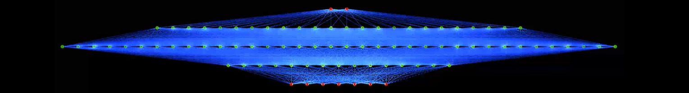

<!-- Reference:
https://github.com/othneildrew/Best-README-Template -->

<!-- PROJECT LOGO -->
 

  <h1 align="center"><i> Feedforward MLP Classifier </i></h1>

  
  
  

    A feed-forward Multi-Layer Perceptron to solve non-linear separable classification problems !
  

 

<!-- TABLE OF CONTENTS -->

  
Table of Contents

  <ol>
    <li><a href="#about-the-project">About The Project</a></li>
    <li><a href="#built-with">Built With</a></li>
    <li><a href="#getting-started">Getting Started</a></li>
    <li><a href="#case-study-analysis">Case Study Analysis</a></li>
    <li><a href="#license-or-author">License or Author</a></li>
    <li><a href="#contact">Contact</a></li>
    <li><a href="#acknowledgments">Acknowledgments</a></li>
  </ol>

 

<!-- ABOUT THE PROJECT -->
## About The Project
  This is a multi-layer perceptron neural network created from scratch, using the backpropagation learning algorithm based on Gradient Descent. The network is custom configurable and can be applied to input from varying domains.

  The network is supervised and is intended for non-linear classification problems, which would be not possible to be solved with a simple Perceptron network.

  For the purpose of analysis, we also tested the network with a large dataset, the results of which can be found in one of the below sections.

  
(<a href="#readme-top">back to top</a>)

## Built With
  &nbsp; &nbsp; &nbsp;  &nbsp; &nbsp;

  &nbsp; &nbsp; &nbsp; <b><i> Python</i></b>

  
(<a href="#readme-top">back to top</a>)

<!-- GETTING STARTED -->
## Getting Started
  #### Prerequisites
  * Python
  * Numpy
  * Pandas
  * sklearn
  * pickle

  #### Installation & Use
  1. Get <b>mlp.py</b>
  2. Import <b>MLP_Neural_Nw</b> in your implementation
  3. Use the functions as per your convinience and configuration.

  
(<a href="#readme-top">back to top</a>)

<!-- USAGE EXAMPLES -->
## Case Study Analysis
  We tried our network with a large data sample - [which can be found in <b>train_data.csv</b> and <b>train_labels.csv</b>].

  The following configuration was utilized:
  * ##### Input Size = 784
     - Since we have 784 features per data point
  
  <spacer type="vertical" height="4" width="2"></spacer>

  * ##### Number of Neurons in the Hidden layer = 100
     - The network is able to achieve a good accuracy using 100 nodes in combination with the rest of configuration; and results in a good cumulative loss which leads to > 98% accuracy for the validation set.

  <spacer type="vertical" height="4" width="2"></spacer>

  * ##### Number of Neurons in the Output layer = 4
     - Since the output labels are one-hot encoded with 4 values.

  <spacer type="vertical" height="4" width="2"></spacer>

  * ##### Learning Rate = 0.2
     - After trying out different values, we found 0.2 to be most effective minimum learning rate.
     - The network could steadily approach the minima, as opposed to higher values, which resulted in greater fluctuations in the cumulative error between different epochs.

  <spacer type="vertical" height="4" width="2"></spacer>

  * ##### Activation Functions:
     - For Hidden Layer: Sigmoid
          Which was the ideal function to be used at the hidden layer
     - For Output Layer: SoftMax
          The output is in one-hot encoded format, with only 1 of the 4 indices holding the value ‘1’. Hence it makes sense to use SoftMax here, which would normalize the output to a network of probability distribution.
  
  <spacer type="vertical" height="4" width="2"></spacer>
  
  * ##### Error/Loss Function: Cross-entropy Loss Function
     - For one-hot encoding, cross-entropy implies that the output label should hold zeroes at all the indices, except one.
     - This works best for our configuration, which uses SoftMax as the activation function at the output layer.
  
  <spacer type="vertical" height="4" width="2"></spacer>

  * ##### Maximum Epochs allowed = 30
     - 30 epochs allowed the network to reach a good-enough cumulative loss value, by not completely exhausting the CPU resources with the given configuration.

  <spacer type="vertical" height="4" width="2"></spacer>

  * ##### Training Size = 90%, Validation Size = 10%
     - We use 90% of the training data for training and 10% for validation. The held-out validation set is used to test the network on unseen data and helps us choose the optimal hyper-parameter setting for our network.

  <spacer type="vertical" height="4" width="2"></spacer>

  * ##### Individual Acceptable Loss = 0.001
     - Used to calculate the acceptable Cumulative Loss, depending on the size of the input set.
      .

  ##### After training the model, it was able to achieve 98.22% accuracy on testing the validation set.

  
(<a href="#readme-top">back to top</a>)

<!-- LICENSE -->
## License or Author
  * Authored by: Uditya Laad, Himalaya Sharma, Dakota Wang - University of Waterloo
  * <b> Case Study</b> : Suggested By Prof. Hatham Amar - University of Waterloo

  
(<a href="#readme-top">back to top</a>)

<!-- CONTACT -->
## Contact
  <b>Uditya Laad</b> &nbsp; [@linkedin.com/in/uditya-laad-222680148](https://www.linkedin.com/in/uditya-laad-222680148/)
  
  &nbsp; &nbsp; &nbsp; &nbsp; &nbsp; &nbsp; &nbsp; &nbsp; &nbsp; &nbsp; &nbsp; &nbsp; [@github.com/udityalaad](https://github.com/udityalaad)
  
  &nbsp; &nbsp; &nbsp; &nbsp; &nbsp; &nbsp; &nbsp; &nbsp; &nbsp; &nbsp; &nbsp; &nbsp; udityalaad123@gmail.com

  <b>Project Link</b> &nbsp; [https://github.com/udityalaad/RBF_NN_for_Map_Approximation](https://github.com/udityalaad/RBF_NN_for_Map_Approximation)

  
(<a href="#readme-top">back to top</a>)

<!-- ACKNOWLEDGMENTS -->
## Acknowledgments
  * ECE 657, Assignment 1, Hatham Amar, University of Waterloo, Waterloo, ON, CA
  * [github.com/othneildrew/Best-README-Template/](https://github.com/othneildrew/Best-README-Template)
  * [Multi Layer Perceptron (MLP) Animation, TopLab - Toplak Laboratory, Youtube](https://www.youtube.com/watch?v=HIpnydr2jK0&ab_channel=TopLab-ToplakLaboratory)

  
(<a href="#readme-top">back to top</a>)

